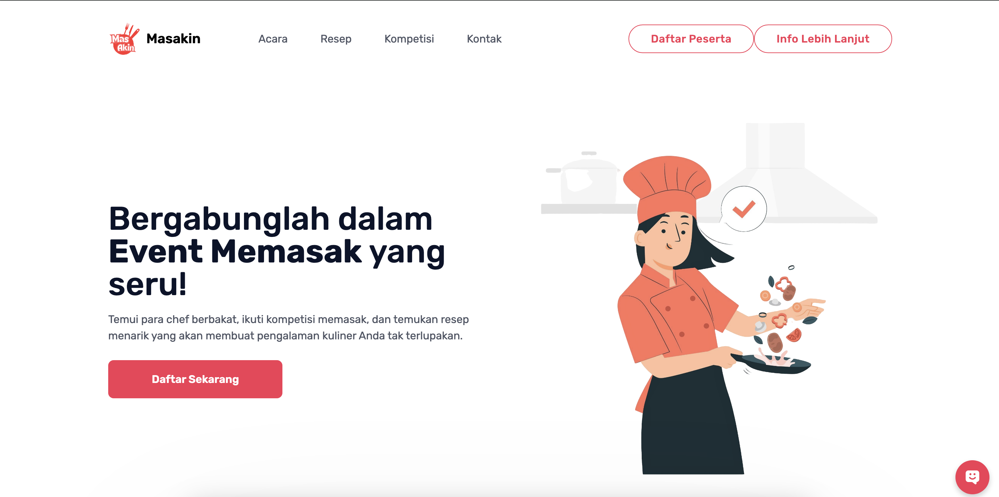

# Masakin Event Dashboard

Welcome to **Masakin Event Dashboard**! This is a web application designed to manage and display event-related information with a focus on a user-friendly experience. It leverages modern web technologies for a seamless and interactive user interface.



## Live Demo

Check out the live version of the project at: [https://masakin.onrender.com/](https://masakin.onrender.com/)

## Features

- **Responsive Design**: Fully responsive layout for desktop and mobile devices.
- **Interactive Navigation**: Smooth scrolling and dynamic navigation for easy access to different sections.
- **User Authentication**: Integration with Clerk for user sign-in and profile management.
- **Dashboard Components**: Key sections like `Acara`, `Resep`, `Kompetisi`, and `Kontak` for event details.
- **Stylish UI**: Modern design with hover effects, smooth transitions, and rounded buttons for an optimal user experience.

## Tech Stack

- **Frontend**: React, Next.js (version 12.3.1)
- **Styling**: Tailwind CSS
- **User Authentication**: Clerk
- **Deployment**: Render.com (hosted live)

## Installation

To set up the project locally, follow these steps:

1. **Clone the repository**:
   ```bash
   git clone https://github.com/zarkasihhh/dummey.git
   cd dummey
   ```

2. **Install dependencies**:
   ```bash
   npm install
   ```

3. **Run the development server**:
   ```bash
   npm run dev
   ```

   Your app will be available at [http://localhost:3000](http://localhost:3000).

## Usage

- Navigate through the dashboard to explore sections such as events, recipes, competitions, and contact information.
- Authenticate using the "Daftar Peserta" button for participant registration and access user-specific content.

## Features in Progress

- Add user role-based permissions.
- Implement more interactive elements and animations.
- Expand on mobile-friendly UI enhancements.

## Contributing

Feel free to fork the repo, create a branch, make improvements, and open a pull request. Contributions are always welcome!

## License

This project is licensed under the MIT License. See the [LICENSE](./LICENSE) file for details.
